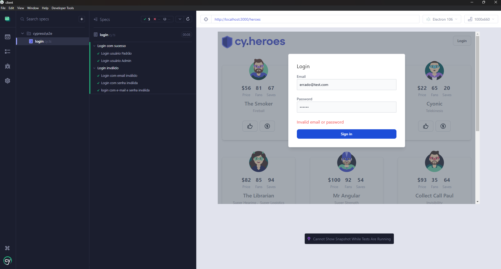

# Automação Cypress Heroes



Aplicação desenvolvida para simular um sistema onde usuários podem realizar login e interagir com heróis fictícios.

As estratégias de automação foram criadas com foco em testes de **ponta a ponta (E2E)**, utilizando **estruturas reutilizáveis** para garantir **eficiência**, **qualidade** e **facilidade de manutenção** dos testes.

### Perfis de Usuário

- 🔹 **Usuário comum:** pode curtir heróis e contratá-los.  
- 🔸 **Administrador:** possui todas as permissões do usuário comum, além de poder **criar**, **editar** e **excluir** heróis.


### **Link dos casos de teste:** 


## Passo a Passo para Instalação

**1.** **Clone o repositório na sua maquina**

```bash
git clone https://github.com/ElizabethGomes-QAEngineer/Cypress-Heroes.git
```

**2.** **Navegue até o diretório do projeto**

```bash
cd cypress-heroes
```

**3.** **Instale as dependências do projeto**

```bash
npm install 
```

**4.** **Configuração de Ambiente**

```bash
npm run setup
```

**5.** **Inicie o servidor de Desenvolvimento**

```bash
npm run dev
```
>
>**Nota** Este Projeto é acessivel em http://localhost:3000.
>


**6.** **Abra outro Terminal e Execute o Cypress para rodar os testes**

abrir o Cypress com interface gráfica (GUI - Graphical User Interface)

```bash
npx cypress open
```

> **NOTA:**
> Acesse na pasta **client** depois **cypress** e **Pages** dentro de **e2e** estão os **specs** deste projeto.
>  
