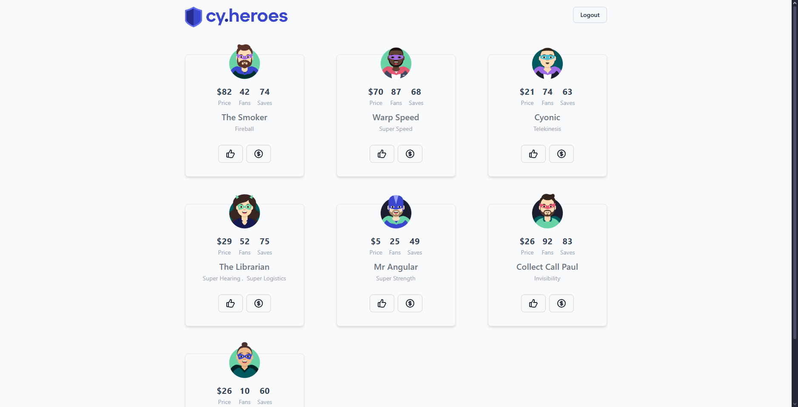

# Login Admin com sucesso

**ID:**  
**Funcionalidade:** Login  
**Título:** Login Admin com credenciais válidas  
**Pré-condições:** O usuário deve estar previamente cadastrado no sistema  
**Prioridade:** Alta  
**Tipo de teste:** Funcional / Positivo  

## Dados de entrada:
**Login:** admin@test.com  
**Senha:** test123  

## Passos:
1. Acessar a URL: http://localhost:3000/heroes  
2. Clicar no botão de login  
3. Inserir o e-mail válido  
4. Inserir a senha correta  
5. Clicar em "Entrar"  

## Resultado Esperado:
O modal de login deve sumir, permanecendo na tela de heróis e o botão "Login" deve ser alterado para "Logout".  

## Evidência:
  

## Steps & Results:
**Given** que o usuário acessou a página de login do sistema  
**And** clicou no botão "Login"  
**When** inserir usuário e senha válidas  
**And** clicar no botão "Sign In"  
**Then** o sistema deve autenticar o usuário  
**And** o modal de login deve sumir, permanecendo na tela de heróis  
**And** o botão "Login" deve ser alterado para "Logout"  
**And** exibir as opções do perfil ADMIN  

## Status:
**APROVADO**  
