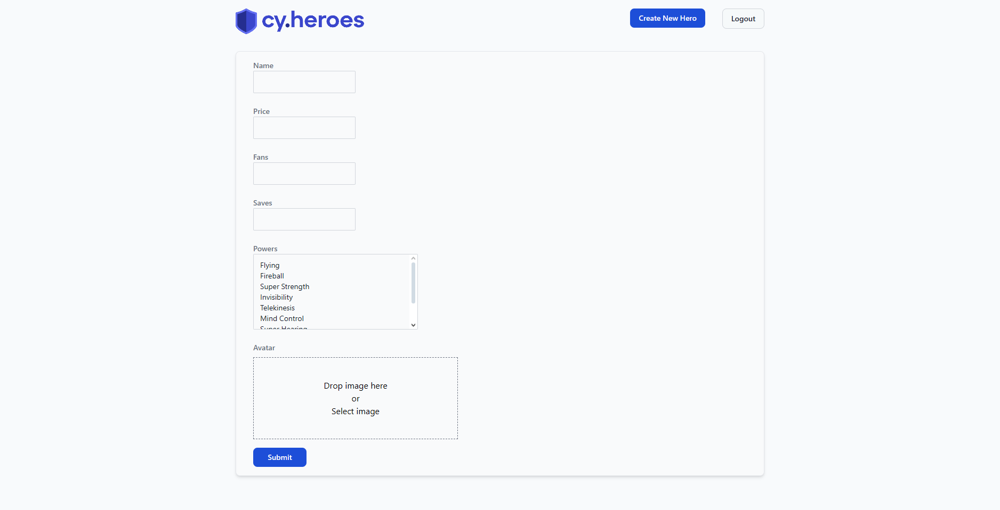

# Criar novo herói

**ID:** 
**Funcionalidade:** Cadastro de herói  
**Título:** Cadastro de novo herói com dados válidos  
**Pré-condições:** O usuário deve estar previamente logado no sistema com uma conta de administrador  
**Prioridade:** Alta  
**Tipo de teste:** Funcional / Positivo  

## Dados de entrada

**Login:** admin@test.com  
**Senha:** test123  

## Passos

1. Acessar o sistema pela URL: http://localhost:3000/heroes  
2. Clicar no botão de login  
3. Inserir o e-mail de administrador válido  
4. Inserir a senha correta  
5. Clicar no botão "Entrar"  
6. Clicar no botão "Create New Hero"  
7. Preencher o campo "Name"  
8. Preencher o campo "Price"  
9. Preencher o campo "Fans"  
10. Preencher o campo "Saves"  
11. Selecionar ao menos um poder no campo "Powers"  
12. Enviar uma imagem no campo "Avatar"  
13. Clicar no botão "Submit"  
14. Verificar se o card do novo herói aparece na listagem

## Resultado Esperado

O herói criado deve ser exibido na listagem de heróis com as seguintes informações visíveis:

- Nome do herói  
- Poder do herói  
- Quantidade de Price  
- Quantidade de Fans  
- Quantidade de Saves  
- Botões disponíveis:
  - Curtir  
  - Contratar  
  - Editar  
  - Excluir  

## Evidência

## Steps & Results (Gherkin)

**Given** que o usuário acessou a página inicial do sistema  
**And** realizou login com credenciais de administrador válidas  
**When** clicar no botão **"Create New Hero"**  
**And** preencher os campos **Name**, **Price**, **Fans**, **Saves**, **Powers** e **Avatar**  
**And** clicar no botão **"Submit"** para criar o novo herói  
**Then** o card com as informações do novo herói deve ser exibido na listagem de heróis  

## Status

**APROVADO**

