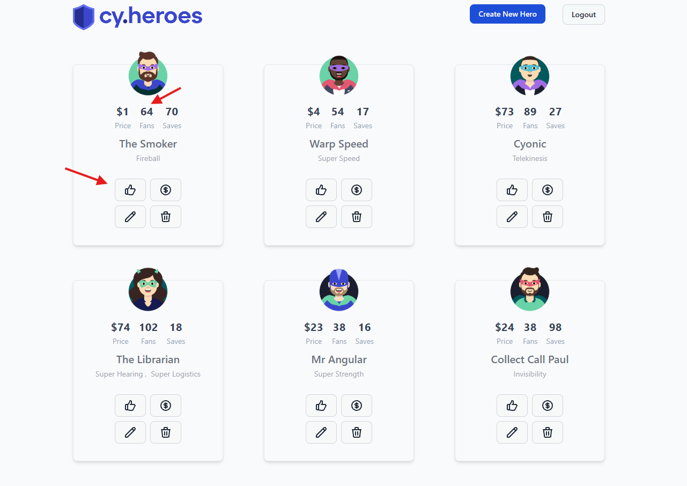

# Curtir herói

**ID:**  
**Funcionalidade:**  Curtir herói  
**Título:** Curtir herói  
**Pré-condições:** O usuário deve estar previamente logado no sistema  
**Prioridade:** Média  
**Tipo de teste:** Funcional / Positivo  

## Dados de entrada

**Login:** test@test.com  
**Senha:** test123  

## Passos

1. Acessar o sistema com a URL: http://localhost:3000/heroes  
2. Clicar no botão de login  
3. Inserir o e-mail válido  
4. Inserir a senha correta  
5. Clicar em "Entrar"  
6. Clicar no botão de curtir herói
7. Verificar se a contagem de curtidas aumentou +1

## Resultado Esperado

O número de curtidas(fans) no card do herói que o usuário curtiu deve aumentar +1 na contagem  

## Evidência

## Steps & Results

**Given** que o usuário acessou a página incial do sistema  
**And** realizou o login usando credenciais válidas  
**When** clicar no botão de curtir herói dentro do card  
**Then** a contagem de curtidas(fans) do herói deve aumentar +1  

## Status

**APROVADO**

