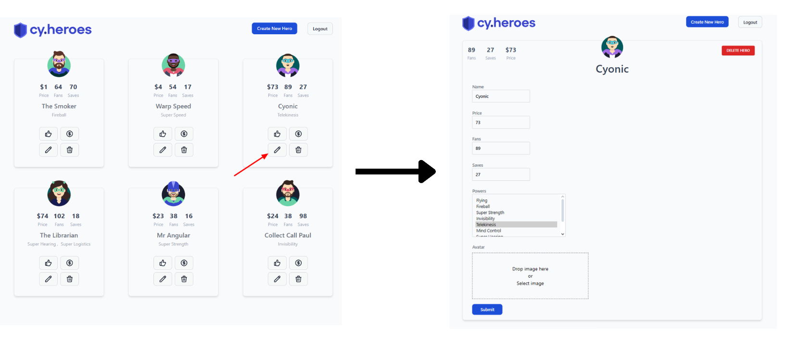

# Editar herói

**ID:** 
**Funcionalidade:** Editar herói  
**Título:** Edição de herói 
**Pré-condições:** O usuário deve estar previamente logado no sistema com uma conta de administrador  
**Prioridade:** Alta  
**Tipo de teste:** Funcional / Positivo  

## Dados de entrada

**Login:** admin@test.com  
**Senha:** test123  

## Passos

1. Acessar o sistema pela URL: http://localhost:3000/heroes  
2. Clicar no botão de login  
3. Inserir o e-mail de administrador válido  
4. Inserir a senha correta  
5. Clicar no botão "Entrar"  
6. Clicar no botão de edição (ícone de lápis) dentro do card do herói
7. Altere o campo "Name"  
8. Altere o campo "Price"  
9. Altere o campo "Fans"  
10. Altere o campo "Saves"  
11. Selecionar ao menos um poder no campo "Powers"  
12. Altere a imagem no campo "Avatar"  
13. Clicar no botão "Submit"  
14. Verificar se o card do herói na listagem reflete as alterações realizadas

## Resultado Esperado

O herói editado deve ser exibido na listagem de heróis com as seguintes informações atualizadas:

- Nome do herói  
- Poder do herói  
- Quantidade de Price  
- Quantidade de Fans  
- Quantidade de Saves  

## Evidência

## Steps & Results (Gherkin)

**Given** que o usuário acessou a página inicial do sistema  
**And** realizou login com credenciais de administrador válidas  
**When** clicar no botão de edição (ícone de lápis) dentro do card do herói que deseja editar  
**And** editar os campos **Name**, **Price**, **Fans**, **Saves**, **Powers** e **Avatar**  
**And** clicar no botão **"Submit"** para concluir a edição do herói  
**Then** o card do herói na listagem deve refletir as alterações realizadas

## Status

**APROVADO**

