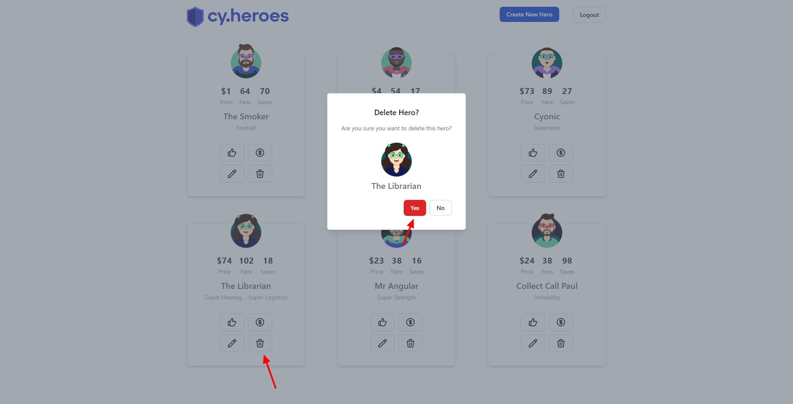
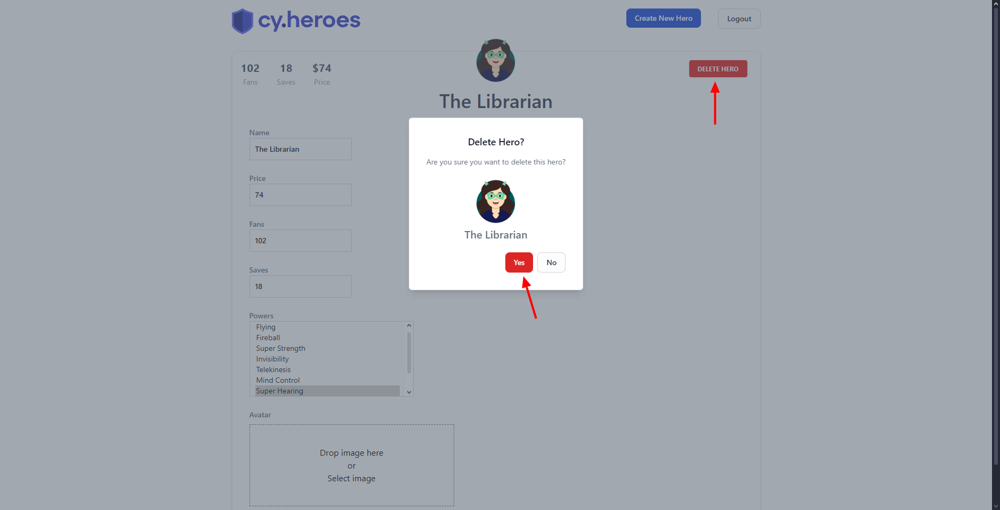

# Exclusão de herói

**ID:**  
**Funcionalidade:** Excluir herói  
**Título:** Exclusão de herói  
**Pré-condições:** O usuário deve estar previamente logado no sistema com uma conta de administrador  
**Prioridade:** Média  
**Tipo de teste:** Funcional / Positivo  

## Dados de entrada

**Login:** admin@test.com  
**Senha:** test123  

## Passos

### Exclusão via página inicial card  

1. Acessar o sistema pela URL: http://localhost:3000/heroes  
2. Clicar no botão de login  
3. Inserir o e-mail de administrador válido  
4. Inserir a senha correta  
5. Clicar no botão "Entrar"  
6. Clicar no botão de exclusão (ícone de lixeira) dentro do card do herói  
7. Clicar na opção "Yes" no pop-up
8. Verificar se o herói foi excluido na listagem de usuários  

### Exclusão dentro da tela de edição de herói  

1. Acessar o sistema pela URL: http://localhost:3000/heroes  
2. Clicar no botão de login  
3. Inserir o e-mail de administrador válido  
4. Inserir a senha correta  
5. Clicar no botão "Entrar"  
6. Clicar no botão de edição (ícone de lápis) dentro do card do herói  
7. Clicar no botão "DELETE HERO"  
8. Clicar na opção "Yes" no pop-up  
9. Verificar se o herói foi excluido na listagem de usuários  
 

## Resultado Esperado

Ao realizar a exclusão do herói, o mesmo deve deixar de ser exibido na listagem de heróis 

## Evidência

## Steps & Results (Gherkin)

### Exclusão via página inicial (card)

**Given** que o usuário acessou a página inicial do sistema  
**And** realizou login com credenciais de administrador válidas  
**When** clicar no botão de exclusão (ícone de lixeira)  
**And** confirmar a ação clicando na opção "Yes" no pop-up de confirmação  
**Then** o herói deve ser excluído  
**And** o card correspondente deve deixar de ser exibido na listagem de heróis

---

### Exclusão via tela de edição do herói

**Given** que o usuário acessou a página inicial do sistema  
**And** realizou login com credenciais de administrador válidas  
**When** clicar no botão de edição (ícone de lápis) dentro do card do herói  
**And** clicar no botão "Delete Hero"  
**And** confirmar a ação clicando na opção "Yes" no pop-up de confirmação  
**Then** o herói deve ser excluído  
**And** o card correspondente deve deixar de ser exibido na listagem de heróis

## Status

**APROVADO**

