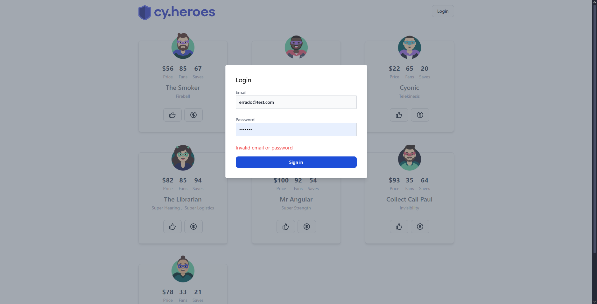

# Login com e-mail inválido

**ID:**  
**Funcionalidade:** Login  
**Título:** Login com e-mail inválido  
**Pré-condições:** O e-mail inserido não deve está cadastrado no sistema  
**Prioridade:** Alta  
**Tipo de teste:** Funcional / Negativo  

## Dados de entrada

**Login:** test@login.com  
**Senha:** test123  

## Passos

1. Acessar o sistema com a URL: http://localhost:3000/heroes  
2. Clicar no botão de login  
3. Inserir o e-mail inválido  
4. Inserir a senha correta  
5. Clicar em "Sing in"  

## Resultado Esperado

Deve ser exibida a mensagem "Invalid email or password" e o usuário deve permanecer na tela de login.  

## Evidência

  

## Steps & Results

**Given** o usuário acessou a página de login do sistema  
**And** clicou no botão "Login"  
**When** inserir login inválido e senha válida  
**And** clicar no botão "Sing in"  
**Then** O sistema deve exibir o erro "Invalid email or password"  
**And** o usuário deve permanecer a tela de login.  

## Status

**Aprovado**  